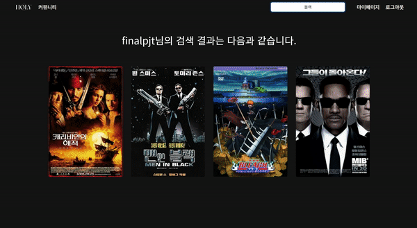
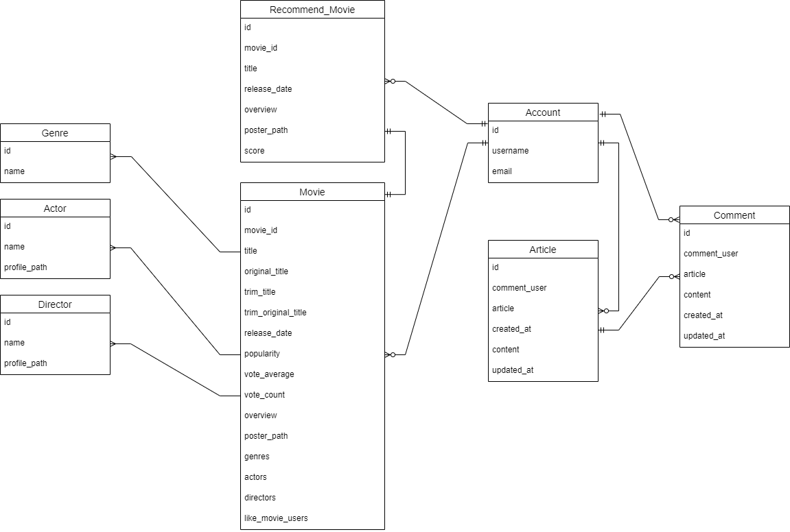

# HOLY CINEMA

### 영화 추천 알고리즘 기반 커뮤니티 서비스(싸피 8기 최종 프로젝트)

***

### 팀원

| 이름  | 담당 영역                                                     | Github                      |
| --- | --------------------------------------------------------- | --------------------------- |
| 김영록 | - 프론트엔드 / 백엔드 - DB 모델링 및 백엔드 로직 구성, 프론트엔드 기능 구현 및 디버깅 | https://github.com/yr7256   |
| 유예지 | - 프론트엔드 / 백엔드 - 역할 적으세요                               | https://github.com/yeahzizi |

### 설명

- 영화 정보 및 알고리즘 추천 사이트
- 기획의도 : 21세기에 20세기를 체험하는 느낌을 주려고 했음. 즉, 풍부한 정보 속에서 영화를 고르는 것이 아닌, 자신의 기호대로 영화를 선택할 수 있는 기회를 주고자 했다. 

### 목표

- 모던한 느낌의 페이지 구성
- 다른 페이지에서는 느낄 수 없는 특별한 사용자 경험
- 영화 데이터 제공 및 유저 데이터 기반 알고리즘 추천 서비스

### 서비스 구현 정도

| No  | 기능                           | 기능 설명                                                 | 구현 정도(⭐⭐⭐⭐⭐) | 실제 구현 수준 |
| --- | ---------------------------- | ----------------------------------------------------- | ------------ | -------- |
| 1   | 로그인                          | all auth를 통한 로그인 기능 구현                                | ⭐⭐⭐⭐⭐        |          |
| 2   | 로그아웃                         | all auth를 통한 로그아웃 기능 구현                               | ⭐⭐⭐⭐⭐        |          |
| 3   | 회원가입                         |                                                       | ⭐⭐⭐⭐⭐        |          |
| 4   | 회원탈퇴                         |                                                       |              | 미구현      |
| 5   | 마이페이지                        | 좋아요한 영화 목록 조회                                         | ⭐⭐⭐          |          |
| 6   | 개인 맞춤 영화 추천                  |                                                       | ⭐⭐⭐⭐⭐        |          |
| 7   | 영화별 좋아요 버튼                   | 상세 페이지에서 좋아요 누르기 기능                                   | ⭐⭐⭐⭐⭐        |          |
| 8   | 검색 기능                        | 영화 한글 이름, 영어 이름, 붙여서 쓰기 검색 기능 구현                      | ⭐⭐⭐⭐⭐        |          |
| 9   | 영화 마우스 커서를 올렸을 때 기능          | 카드 구성                                                 | ⭐⭐⭐⭐⭐        |          |
| 10  | 영화 상세페이지                     |                                                       | ⭐⭐⭐⭐         |          |
| 11  | 개별 영화 페이지에서 게시글 작성 기능        |                                                       |              | 미구현      |
| 11  | 개별 영화 페이지에서 배우, 감독 상세페이지로 이동 | 페이지 내에서 구현하는데 실패해 TMDB로 이동하게 구성                       | ⭐⭐           |          |
| 12  | 영화 좋아요 기능                    | 좋아요 등록/취소 기능 구현                                       | ⭐⭐⭐⭐⭐        |          |
| 13  | 댓글 기능                        | 로그인한 사용자만 게시글에 댓글 쓰기 기능 구현                            | ⭐⭐⭐⭐⭐        |          |
| 14  | 게시글 CRUD                     | 로그인한 사용자만 게시글 생성/조회/수정/삭제 가능                   | ⭐⭐⭐⭐⭐        |          |
| 15  | 댓글 C,R,D                     | 로그인한 사용자만 댓글 생성/조회/삭제 가능                  | ⭐⭐⭐⭐⭐        |          |

### 상세 화면 구성

> 메인 페이지

> 검색 기능

> 영화 상세 페이지

> 회원가입

> 게시판

> 404 Not Found 출력

### 데이터 베이스 모델링 (ERD)

### 느낀 점
